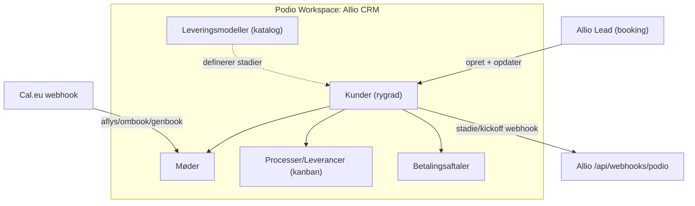

# Podio CRM — opsætning

Denne guide opsætter Podio som skalerbart CRM for Allio: når et møde bookes i Allio,
oprettes kunden automatisk i Podio med kundekort, onboarding-møde og et sæt
proces-/leverance-items (kanban). Cal.eu-webhooken holder møde-status synkroniseret.

> Rollefordeling: **Allio** booker mødet og opretter kunden. **Podio** styrer pipeline,
> leverancer (kanban pr. medarbejder), leveringsmodeller og betalingsaftaler.
> **Cal.eu** holder kalender + mødelinks.

Allio-koden slår Podio-felter op **via deres etiket (label)**, ikke via tekniske id'er.
Navngiv derfor felterne **præcis** som nedenfor, og brug **den rigtige Podio-felttype**
(ikke bare Tekst overalt). Det giver klikbare telefonnumre/e-mails, links, kortvisning
og bedre rapportering. API-koden formaterer værdier automatisk efter felttypen.

> **Booket af / Ansvarlig = Tekst (ikke Medlem):** Sælgere og mange medarbejdere
> arbejder kun i Allio — de skal ikke have en betalt Podio-bruger. Navnet synkroniseres
> eller udfyldes som tekst. Kun jeres leverance-team behøver Podio-login.
>
> **Kontonummer / Registreringsnummer = Tekst (ikke Tal):** Danske reg.nr. kan have
> foranstillede nuller (fx `0408`). Tal-feltet ville gemme det som `408` — derfor tekst.

---

## Datamodel (relationelt = skalerbart CRM)



**Sådan hænger det sammen:**
- En **Leveringsmodel** (fx *Genaktivering*) definerer hvilke stadier en kunde følger.
  Sælger I senere noget andet, opretter I en ny model med flere/færre stadier.
- **Kunder** er rygraden — ét item pr. kunde, med ét overordnet **Stadie**.
- **Processer/Leverancer** er de konkrete opgaver (kanban: *Ikke startet → I gang →
  Færdig*), hver med en **ansvarlig** medarbejder. Det er her det daglige arbejde styres.
- Apps "taler sammen" via **Relationship-felter** (Kunde ↔ Møder/Processer/Betalinger).

---

## 1. Opret workspace

Opret et workspace, fx **"Allio CRM"**.

## 2. Opret apps

Opret følgende 5 apps (Add app → Create from scratch). Navngiv felterne **nøjagtigt**
som vist (inkl. store/små bogstaver og tegn).

### App: Kunder (rygrad)

| Felt-etiket (label) | Podio-felttype | Bemærkning |
|---|---|---|
| `Virksomhed` | Tekst | Appens titel-felt |
| `Kontaktperson` | Tekst | |
| `Telefon` | Telefon | Klikbart nummer i Podio |
| `Email` | Email | Klikbar mailto |
| `CVR` | Tekst | Bevarer format |
| `Adresse` | Placering | Gade + postnr + by (synk fra Allio) |
| `Kontonummer` | Tekst | Manuel ved Kick-off 2 — **ikke Tal** (bevarer nuller) |
| `Registreringsnummer` | Tekst | Manuel ved Kick-off 2 — **ikke Tal** (fx `0408`) |
| `Booket af` | Tekst | Sælgerens navn fra Allio — ingen Podio-licens nødvendig |
| `Første mødelink` | Link | Google Meet/Cal-link |
| `Allio Lead ID` | Tekst | Teknisk nøgle — rør den ikke |
| `Cal booking uid` | Tekst | Teknisk — kan skjules |
| `Stadie` | Kategori (single) | Pipeline — se nedenfor |
| `Leveringsmodel` | Relation → Leveringsmodeller | Sættes automatisk til Genaktivering |

**Kategorier på `Stadie`** (Genaktiverings-modellen, i denne rækkefølge):

1. `Møde booket`
2. `Gecko åbnet`
3. `Møde afholdt`
4. `Kick-off prep`
5. `SMS Levering`
6. `Kick-off afholdt`
7. `Kampagne kørt`
8. `Loom Levering`
9. `Opsalg & Binding`
10. `Løbende aftale`
11. `Tabt/Annulleret`

> Når I senere tilføjer en ny leveringsmodel med andre stadier, tilføjer I bare dens
> stadier til denne kategori (fx med modelnavn som præfiks) og filtrerer visninger på
> `Leveringsmodel`.

### App: Møder

| Felt-etiket | Podio-felttype | Bemærkning |
|---|---|---|
| `Kunde` | Relation → Kunder | |
| `Type` | Kategori (single) | `Onboarding`, `Kick-off`, `Strategi/Performance`, `Årsmøde` |
| `Dato & tid` | Dato (med tidspunkt) | |
| `Mødelink` | Link | |
| `Status` | Kategori (single) | `Booket`, `Afholdt`, `Aflyst`, `Genbook` |
| `Fathom-noter` | Tekst (multi line) | Eller link til optagelse |
| `Ansvarlig` | Tekst | Navn på den der afholder mødet |

### App: Processer/Leverancer (kanban)

Dette er kanban-boardet (jf. *Not started / Work-in-progress / Completed*).
Allio opretter automatisk et standard-sæt processer pr. kunde.

| Felt-etiket | Podio-felttype | Bemærkning |
|---|---|---|
| `Proces` | Tekst | Appens titel-felt (procesnavn) |
| `Kunde` | Relation → Kunder | |
| `Ansvarlig` | Tekst | Navn på ansvarlig medarbejder — filter i kanban |
| `Status` | Kategori (single) | `Ikke startet`, `I gang`, `Færdig` |
| `Noter` | Tekst (multi line) | Fx Fathom-noter eller PDF-link |

> **Kanban-visning:** opret en visning af typen *Board*, grupperet på `Status`.
> Brug `Ansvarlig` som filter, så hver medarbejder ser sine egne leverancer.

Standard-processer Allio opretter pr. kunde (status `Ikke startet`):
`Gecko åbnet`, `Onboarding-noter (Fathom)`, `Kick-off PDF`, `SMS-kampagneflow`,
`Loom Levering`, `Opsalg & Binding`.

### App: Betalingsaftaler

| Felt-etiket | Podio-felttype | Bemærkning |
|---|---|---|
| `Kunde` | Relation → Kunder | |
| `Model` | Kategori (single) | `No cure no pay`, `Månedlig betaling`, `12 mrd. binding` |
| `Beløb` | Beløb | |
| `Rabat` | Beløb | |
| `Bindingsperiode` | Tekst | |
| `Betalingskort indsat` | Kategori (single) | `Ja`, `Nej` |
| `Kontraktstatus` | Kategori (single) | `Ikke sendt`, `Sendt`, `Accepteret` |
| `Startdato` | Dato | |

### App: Leveringsmodeller (katalog)

| Felt-etiket | Podio-felttype | Bemærkning |
|---|---|---|
| `Navn` | Tekst | Titel-felt |
| `Beskrivelse` | Tekst (multi line) | |
| `Standardpris` | Beløb | |
| `Stadier` | Tekst (multi line) | Dokumentér modellens stadie-rækkefølge |

**Vigtigt:** Opret ét item her med `Navn` = **"Genaktivering"** og sæt dets
**external_id til `genaktivering`** (se afsnit 4 om external_id). Allio kobler nye
kunder til netop dette item.

---

## 3. API-nøgle (client_id / client_secret)

1. Gå til <https://podio.com/settings/api> og generér en API-nøgle.
2. Notér **Client ID** og **Client Secret**.

## 4. App-id, app-token og external_id

For hver app (**Kunder**, **Møder**, **Processer/Leverancer**, **Betalingsaftaler**,
**Leveringsmodeller**):

1. Åbn appen → menuen (···) → **Developer**.
2. Notér **App ID** og **Token** (app-token).

**Sæt external_id på Genaktiverings-item'et:** Åbn item'et i Leveringsmodeller, og sæt
dets `external_id` til `genaktivering`. Hvis UI'et ikke tillader det, kan det sættes via
API (PUT `/item/{item_id}` med `{ "external_id": "genaktivering" }`).

## 5. Miljøvariabler

Sæt følgende i `.env.local` (lokalt) og i Vercel (Production). Se `.env.example`:

```
PODIO_CLIENT_ID="..."
PODIO_CLIENT_SECRET="..."
PODIO_KUNDER_APP_ID="30763818"
PODIO_KUNDER_APP_TOKEN="c86991e37b239caa8e1c5b3b2ee6d644"
PODIO_MOEDER_APP_ID="30763820"
PODIO_MOEDER_APP_TOKEN="c97a5492dae0f90e070ada2310950f2d"
PODIO_PROCESSER_APP_ID="30763823"
PODIO_PROCESSER_APP_TOKEN="45474c83ea42646590d8b107a07c0a95"
PODIO_BETALING_APP_ID="30763824"
PODIO_BETALING_APP_TOKEN="f6f6df4be222efeb20feb13f0989f7ae"
PODIO_LEVERING_APP_ID="30763825"
PODIO_LEVERING_APP_TOKEN="cccecec7093ec7016c3b824c306d5f50"
# Valgfri: beskytter den indgående Podio-webhook
PODIO_WEBHOOK_SECRET="lang-tilfaeldig-streng"
```

Hver del er **uafhængig**: Allio opretter Kunde så snart Kunder-appen er sat op, og
tilføjer Møde/Processer/Leveringsmodel når de respektive apps også er konfigureret.

---

## 6. Kunde-journey (sådan flyder data)

1. **Møde booket** (Allio): kunde + onboarding-møde + processer oprettes i Podio.
2. **Gecko åbnet**: vi sender Gecko en mail for at åbne kundens booking-API. Markeres
   manuelt på `Gecko åbnet`-processen (kan springes over).
3. **Møde afholdt**: onboarding-mødet holdes (mødelink ligger allerede i Podio fra Cal.eu).
   Aftal næste kick-off — datoen noteres på et Kick-off-møde i Møder.
4. **Kick-off prep**: Fathom-noter + kick-off PDF (processer/kanban).
5. **SMS Levering**: SMS-kampagneflow sættes op og klargøres (før kick-off-mødet).
6. **Kick-off afholdt**: kick-off-møde afholdes — konto + reg.nr. indsættes på kunden.
7. **Kampagne kørt**: SMS-kampagnen er sat i gang og kører.
8. **Loom Levering**: resultat-/Loom-video sendes til kunden (retainer-review).
9. **Opsalg & Binding**: sælger følger op på binding/opsalg.
10. **Løbende aftale** eller **Tabt/Annulleret**.

> Trin 4–7's automatik (PDF→Allio SMS, mails, auto-kickoff-booking i Cal.eu) bygges i
> senere faser. Strukturen er forberedt: processerne findes, og den indgående webhook
> er klar som udvidelsespunkt.

---

## 7. (Valgfri) Indgående webhook: Podio → Allio

Allio kan reagere når noget ændres i Podio (fx stadie-skift eller en proces, der
markeres `Færdig`). Endpoint: `https://<domæne>/api/webhooks/podio`
(valgfrit `?token=<PODIO_WEBHOOK_SECRET>`).

Registrér en hook på **Kunder**-appen via Podios API:

```bash
# 1) Hent access token (app-auth) for Kunder-appen
curl -s https://podio.com/oauth/token \
  -d grant_type=app \
  -d app_id=$PODIO_KUNDER_APP_ID \
  -d app_token=$PODIO_KUNDER_APP_TOKEN \
  -d client_id=$PODIO_CLIENT_ID \
  -d client_secret=$PODIO_CLIENT_SECRET
# -> kopier "access_token" fra svaret

# 2) Registrér hook på Kunder-appen (item.update)
curl -s -X POST "https://api.podio.com/hook/app/$PODIO_KUNDER_APP_ID/" \
  -H "Authorization: OAuth2 <ACCESS_TOKEN>" \
  -H "Content-Type: application/json" \
  -d '{"url":"https://<domæne>/api/webhooks/podio?token=<PODIO_WEBHOOK_SECRET>","type":"item.update"}'
```

Podio sender straks et `hook.verify`-kald med en `code`. Allios endpoint håndterer
verifikationen automatisk. Når den er bekræftet, er hooken aktiv.

> Bemærk: Podio kan kun nå offentlige HTTPS-URL'er — virker i produktion (Vercel),
> ikke mod localhost uden en tunnel (fx ngrok).

---

## 8. Begrænsninger (gratis plan)

- **100 items i alt** på tværs af alle apps. Hver kunde koster ~1 (Kunde) + 1 (Møde) +
  6 (Processer) = ca. 8 items. Opgradér til Plus/Premium når I skalerer.
- **1.000 API-kald/dag** — rigeligt ved lav volumen.
