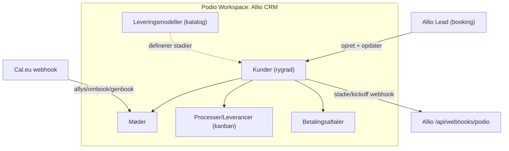

# Podio CRM — opsætning

Denne guide opsætter Podio som skalerbart CRM for Allio: når et møde bookes i Allio,
oprettes kunden automatisk i Podio med kundekort, onboarding-møde og et sæt
proces-/leverance-items (kanban). Cal.eu-webhooken holder møde-status synkroniseret.

> Rollefordeling: **Allio** booker mødet og opretter kunden. **Podio** styrer pipeline,
> leverancer (kanban pr. medarbejder), leveringsmodeller og betalingsaftaler.
> **Cal.eu** holder kalender + mødelinks.

Allio-koden slår Podio-felter op **via deres etiket (label)**, ikke via tekniske id'er.
Navngiv derfor felterne **præcis** som nedenfor, og brug **den rigtige Podio-felttype**
(ikke bare Tekst overalt). Det giver klikbare telefonnumre/e-mails, links, kortvisning
og bedre rapportering. API-koden formaterer værdier automatisk efter felttypen.

> **Booket af / Ansvarlig = Tekst (ikke Medlem):** Sælgere og mange medarbejdere
> arbejder kun i Allio — de skal ikke have en betalt Podio-bruger. Navnet synkroniseres
> eller udfyldes som tekst. Kun jeres leverance-team behøver Podio-login.
>
> **Kontonummer / Registreringsnummer = Tekst (ikke Tal):** Danske reg.nr. kan have
> foranstillede nuller (fx `0408`). Tal-feltet ville gemme det som `408` — derfor tekst.

---

## Datamodel (relationelt = skalerbart CRM)



**Sådan hænger det sammen:**
- En **Leveringsmodel** (fx *Genaktivering*) definerer hvilke stadier en kunde følger.
  Sælger I senere noget andet, opretter I en ny model med flere/færre stadier.
- **Kunder** er rygraden — ét item pr. kunde, med ét overordnet **Stadie**.
- **Processer/Leverancer** er de konkrete opgaver (kanban: *Ikke startet → I gang →
  Færdig*), hver med en **ansvarlig** medarbejder. Det er her det daglige arbejde styres.
- Apps "taler sammen" via **Relationship-felter** (Kunde ↔ Møder/Processer/Betalinger).

---

## 1. Opret workspace

Opret et workspace, fx **"Allio CRM"**.

## 2. Opret apps

Opret følgende 5 apps (Add app → Create from scratch). Navngiv felterne **nøjagtigt**
som vist (inkl. store/små bogstaver og tegn).

### App: Kunder (rygrad)

| Felt-etiket (label) | Podio-felttype | Bemærkning |
|---|---|---|
| `Virksomhed` | Tekst | Appens titel-felt |
| `Kontaktperson` | Tekst | |
| `Telefon` | Telefon | Klikbart nummer i Podio |
| `Email` | Email | Klikbar mailto |
| `CVR` | Tekst | Bevarer format |
| `Adresse` | Placering | Gade + postnr + by (synk fra Allio) |
| `Kontonummer` | Tekst | Manuel ved Kick-off 2 — **ikke Tal** (bevarer nuller) |
| `Registreringsnummer` | Tekst | Manuel ved Kick-off 2 — **ikke Tal** (fx `0408`) |
| `Booket af` | Tekst | Sælgerens navn fra Allio — ingen Podio-licens nødvendig |
| `Første mødelink` | Link | Google Meet/Cal-link |
| `Allio Lead ID` | Tekst | Teknisk nøgle — rør den ikke |
| `Cal booking uid` | Tekst | Teknisk — kan skjules |
| `Stadie` | Kategori (single) | Pipeline — se nedenfor |
| `Leveringsmodel` | Relation → Leveringsmodeller | Sættes automatisk til Genaktivering |

**Kategorier på `Stadie`** (Genaktiverings-modellen, i denne rækkefølge):

1. `Møde booket`
2. `Gecko åbnet`
3. `Møde afholdt`
4. `Kick-off prep`
5. `SMS Levering`
6. `Kick-off afholdt`
7. `Kampagne kørt`
8. `Loom Levering`
9. `Opsalg & Binding`
10. `Løbende aftale`
11. `Tabt/Annulleret`

> Når I senere tilføjer en ny leveringsmodel med andre stadier, tilføjer I bare dens
> stadier til denne kategori (fx med modelnavn som præfiks) og filtrerer visninger på
> `Leveringsmodel`.

### App: Møder

| Felt-etiket | Podio-felttype | Bemærkning |
|---|---|---|
| `Kunde` | Relation → Kunder | |
| `Type` | Kategori (single) | `Onboarding`, `Kick-off`, `Strategi/Performance`, `Årsmøde` |
| `Dato & tid` | Dato (med tidspunkt) | Onboarding/kick-off mødets faktiske tid |
| `Kick-off dato` | Dato (med tidspunkt) | **Kun på onboarding-mødet** — udfyldes før Afholdt (ikke et stadie) |
| `Mødelink` | Link | |
| `Status` | Kategori (single) | `Booket`, `Afholdt`, `Aflyst`, `Genbook` |
| `Fathom-noter` | Tekst (multi line) | Eller link til optagelse |
| `Ansvarlig` | Tekst | Navn på den der afholder mødet |

### App: Processer/Leverancer (kanban)

Dette er kanban-boardet (jf. *Not started / Work-in-progress / Completed*).
Allio opretter automatisk et standard-sæt processer pr. kunde.

| Felt-etiket | Podio-felttype | Bemærkning |
|---|---|---|
| `Proces` | Tekst | Appens titel-felt (procesnavn) |
| `Kunde` | Relation → Kunder | |
| `Ansvarlig` | Tekst | Navn på ansvarlig medarbejder — filter i kanban |
| `Status` | Kategori (single) | `Ikke startet`, `I gang`, `Færdig` |
| `Noter` | Tekst (multi line) | Fx Fathom-noter eller PDF-link |

> **Kanban-visning:** opret en visning af typen *Board*, grupperet på `Status`.
> Brug `Ansvarlig` som filter, så hver medarbejder ser sine egne leverancer.

Standard-processer Allio opretter **stadie-drevet** (lazy, ikke alle på én gang ved booking):

| Minimum-stadie | Proces |
|---|---|
| Møde booket | `Gecko åbnet` |
| Kick-off prep | `SMS-kampagne levering` (Fathom-noter i `Noter`; status `Ikke startet` → `I gang` → `Færdig`) |
| Kampagne kørt | `Loom Levering` |
| Opsalg & Binding | `Opsalg & Binding` |

Ved booking oprettes kun **Gecko åbnet**. Resten oprettes når `Stadie` rykkes fremad
(via Podio-webhook eller når Allio sætter stadie efter afholdt møde). Går I **tilbage**
i `Stadie`, sletter Allio processer for for høje stadier (automatisk rollback).
`Tabt/Annulleret` sletter alle aktive processer for kunden.

> **Mødetid:** Allio sender dato/tid til Podio som **UTC** (app-auth), så 09:00 dansk
> tid vises som 09:00 i Podio — ikke +2 timer.

### App: Betalingsaftaler

| Felt-etiket | Podio-felttype | Bemærkning |
|---|---|---|
| `Kunde` | Relation → Kunder | |
| `Model` | Kategori (single) | `No cure no pay`, `Månedlig betaling`, `12 mrd. binding` |
| `Beløb` | Beløb | |
| `Rabat` | Beløb | |
| `Bindingsperiode` | Tekst | |
| `Betalingskort indsat` | Kategori (single) | `Ja`, `Nej` |
| `Kontraktstatus` | Kategori (single) | `Ikke sendt`, `Sendt`, `Accepteret` |
| `Startdato` | Dato | |

### App: Leveringsmodeller (katalog)

| Felt-etiket | Podio-felttype | Bemærkning |
|---|---|---|
| `Navn` | Tekst | Titel-felt |
| `Beskrivelse` | Tekst (multi line) | |
| `Standardpris` | Beløb | |
| `Stadier` | Tekst (multi line) | Dokumentér modellens stadie-rækkefølge |

**Vigtigt:** Opret ét item her med `Navn` = **"Genaktivering"** og sæt dets
**external_id til `genaktivering`** (se afsnit 4 om external_id). Allio kobler nye
kunder til netop dette item.

---

## 3. API-nøgle (client_id / client_secret)

1. Gå til <https://podio.com/settings/api> og generér en API-nøgle.
2. Notér **Client ID** og **Client Secret**.

## 4. App-id, app-token og external_id

For hver app (**Kunder**, **Møder**, **Processer/Leverancer**, **Betalingsaftaler**,
**Leveringsmodeller**):

1. Åbn appen → menuen (···) → **Developer**.
2. Notér **App ID** og **Token** (app-token).

**Sæt external_id på Genaktiverings-item'et:** Åbn item'et i Leveringsmodeller, og sæt
dets `external_id` til `genaktivering`. Hvis UI'et ikke tillader det, kan det sættes via
API (PUT `/item/{item_id}` med `{ "external_id": "genaktivering" }`).

## 5. Miljøvariabler

Sæt følgende i `.env.local` (lokalt) og i Vercel (Production). Se `.env.example`:

```
PODIO_CLIENT_ID="..."
PODIO_CLIENT_SECRET="..."
PODIO_KUNDER_APP_ID="30763818"
PODIO_KUNDER_APP_TOKEN="c86991e37b239caa8e1c5b3b2ee6d644"
PODIO_MOEDER_APP_ID="30763820"
PODIO_MOEDER_APP_TOKEN="c97a5492dae0f90e070ada2310950f2d"
PODIO_PROCESSER_APP_ID="30763823"
PODIO_PROCESSER_APP_TOKEN="45474c83ea42646590d8b107a07c0a95"
PODIO_BETALING_APP_ID="30763824"
PODIO_BETALING_APP_TOKEN="f6f6df4be222efeb20feb13f0989f7ae"
PODIO_LEVERING_APP_ID="30763825"
PODIO_LEVERING_APP_TOKEN="cccecec7093ec7016c3b824c306d5f50"
# Valgfri: beskytter den indgående Podio-webhook
PODIO_WEBHOOK_SECRET="lang-tilfaeldig-streng"
```

Hver del er **uafhængig**: Allio opretter Kunde så snart Kunder-appen er sat op, og
tilføjer Møde/Processer/Leveringsmodel når de respektive apps også er konfigureret.

---

## 6. Kunde-journey (sådan flyder data)

### Booking (Allio → Podio, hurtig)

Når et møde bookes i Allio, gemmes leadet med det samme i databasen. Cal.eu-booking og
Podio-sync (kunde + onboarding-møde + `Gecko åbnet`-proces) kører **i baggrunden** på
serveren, så dialeren kan gå til næste lead med det samme.

Allio opretter i Podio:

1. **Kunde** med `Stadie = Møde booket`
2. **Onboarding-møde** (`Type = Onboarding`, `Status = Booket`) med korrekt lokal tid
3. **Én proces:** `Gecko åbnet` (ikke alle leverancer på én gang)

### Stadie og processer (Podio ↔ Allio)

| Stadie | Synlige processer i Podio |
|---|---|
| **Møde booket** | Kun `Gecko åbnet` |
| **Gecko åbnet** | Kun `Gecko åbnet` |
| **Møde afholdt** | Kun `Gecko åbnet` (mellemstadie — flere processer kommer først ved Kick-off prep) |
| **Kick-off prep** | `Gecko åbnet` + `SMS-kampagne levering` |
| **Kampagne kørt** | Ovenstående + `Loom Levering` |
| **Opsalg & Binding** | Ovenstående + `Opsalg & Binding` |

| Stadie / hændelse | Hvad sker |
|---|---|
| **Møde booket** | Kunde + onboarding-møde + `Gecko åbnet` |
| **Gecko åbnet** | Manuel proces — Gecko-mail for booking-API |
| **Møde afholdt** (onboarding) | Se **Kick-off fra onboarding** nedenfor |
| **Kick-off prep** | `SMS-kampagne levering` oprettes (`Ikke startet`); Fathom-noter kopieres til `Noter` |
| **Kick-off afholdt** | Podio Kick-off-møde `Status = Afholdt` → `Stadie = Kampagne kørt` + `Loom Levering` |
| **Kick-off aflyst/genbook** | Proces `Kick-off opfølgning` med noter (ikke Allio Genbook-kampagne) |
| **Onboarding aflyst** (Cal eller Podio) | Møde `Aflyst`, `Stadie = Tabt/Annulleret`, **alle processer slettes** — lead flyttes til Genbook i Allio |
| **Genbook efter annullering** | Ved ny booking: `Stadie = Møde booket` + frisk `Gecko åbnet` |
| **Kampagne kørt** | SMS-kampagnen kører |
| **Opsalg & Binding** | `Opsalg & Binding`-proces oprettes |
| **Løbende aftale** | TODO — automatisk procesmodel udskydes |
| **Tabt/Annulleret** | Alle processer slettes for kunden (inkl. kick-off opfølgning) |

**Rollback:** Ændrer I `Stadie` manuelt tilbage i Podio (fx fra Kick-off prep til Møde
afholdt), sletter Allio automatisk processer der hører til højere stadier. Podio kan
ikke vise en bekræftelsesdialog på webhooks — brug stadie-rollback til at rette fejl.

**Manuel reparation:** Hvis processer mangler efter stadie-ændring (fx webhook var nede):

```bash
set -a && source .env.local && set +a
node scripts/podio-sync-processes.mjs <leadId>
# eller: npx tsx scripts/podio-sync-processes.ts <leadId>
```

### Kick-off fra onboarding (kun i Podio)

Alt sker i Podio — Allio reagerer via webhook i baggrunden:

1. På **onboarding-mødet**: udfyld `Fathom-noter`
2. Udfyld **`Kick-off dato`** (dato/tid for næste møde — **ikke** et stadie)
3. Sæt `Status` til **`Afholdt`**
4. Allio opretter automatisk:
   - `Stadie = Kick-off prep` + `SMS-kampagne levering`-proces
   - Fathom-noter kopieres til **`SMS-kampagne levering`**-processens `Noter`
   - Nyt **kick-off-møde** (`Type = Kick-off`, `Status = Booket`) med link
   - **Cal.eu-booking** (event type `CALCOM_KICKOFF_EVENT_TYPE_ID`, fx `342780`) + kalenderinvitation til kunden

Onboarding-mødet forbliver `Afholdt` med Fathom-noter (historik).

**Kick-off aflyst** i Podio → proces `Kick-off opfølgning` (`I gang`) med noter om planlagt tid.

**Kick-off Genbook** i Podio → samme opfølgningsproces med noter om oprindelig tid (flytter
**ikke** lead til Allio Genbook-kampagnen — det er kun for salgs-onboarding).

> Tilføj feltet `Kick-off dato` manuelt i Møder-appen (Dato med tid) hvis det mangler.
> Podio API tillader ikke felt-oprettelse via app-token — brug Podio UI:
> Møder → Customize → Add field → **Kick-off dato** (date + time).
> Verificér med: `node scripts/podio-verify.mjs`

> Trin med PDF→Allio SMS, mails og auto-kickoff-booking i Cal.eu bygges i senere faser.

---

## 7. Indgående webhook: Podio → Allio

Endpoint: `https://<domæne>/api/webhooks/podio` (valgfrit `?token=<PODIO_WEBHOOK_SECRET>`).

Registrér `item.update`-hooks på **Møder**, **Kunder** og **Processer**-appen:

```bash
node scripts/podio-register-hooks.mjs --url=https://allio-leads.vercel.app
# --list     vis eksisterende hooks
# --replace  gendan hooks (slet + opret)
```

**Møder-app** reagerer på:

- `Status = Genbook` → lead flyttes til Genbook-kampagnen i Allio (additivt)
- `Status = Afholdt` + `Type = Onboarding` (+ udfyldt `Kick-off dato`) → kick-off-møde + Cal.eu + stadie
- `Status = Afholdt` + `Type = Kick-off` → `Stadie = Kampagne kørt` + proces-sync
- `Status = Aflyst` + `Type = Kick-off` → opfølgningsproces med noter
- `Status = Aflyst` + `Type = Onboarding` → `Stadie = Tabt/Annulleret` + slet alle processer
- `Status = Genbook` + `Type = Onboarding` → Allio Genbook-kampagne
- `Status = Genbook` + `Type = Kick-off` → opfølgningsproces (ikke Allio Genbook)

**Kunder-app** reagerer på:

- Ændring af `Stadie` → opret manglende processer / slet ved rollback

**Processer-app** reagerer på:

- `Gecko åbnet` → `Status = Færdig` → `Stadie = Gecko åbnet` (hvis kunden ikke allerede er længere)

**Cal.eu → Allio** (onboarding, event type `340981`):

- `BOOKING_CANCELLED` / no-show → Genbook i Allio + Podio møde `Aflyst` + `Tabt/Annulleret` + slet processer
- `BOOKING_RESCHEDULED` → ingen proces-sletning (ombook)

Podio sender straks et `hook.verify`-kald. Allios endpoint validerer på begge apps
automatisk. Når den er bekræftet, er hooken aktiv.

> `hook.verify` kræver ikke `?token=` i URL'en (Podio sender den ikke altid). Øvrige
> webhook-kald (`item.update`) kræver stadig `PODIO_WEBHOOK_SECRET` i query-strengen.

> Podio kan kun nå offentlige HTTPS-URL'er — virker i produktion (Vercel), ikke mod
> localhost uden tunnel (fx ngrok).

---

## 8. Begrænsninger (gratis plan)

- **100 items i alt** på tværs af alle apps. Hver ny kunde koster ca. 1 (Kunde) + 1
  (Møde) + 1–6 (Processer, stadie-drevet) = typisk **3 items ved booking**, flere
  efterhånden som kunden rykker frem i pipelinen. Opgradér til Plus/Premium når I skalerer.
- **1.000 API-kald/dag** — rigeligt ved lav volumen.
