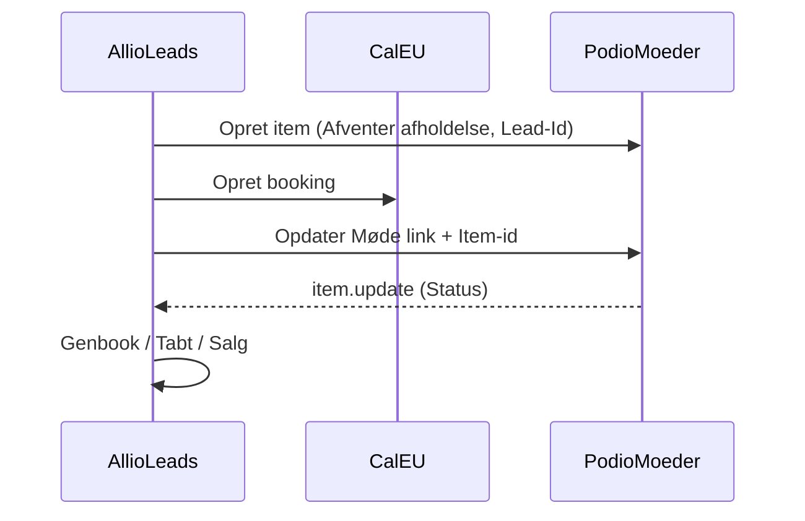

# Podio — Salg / Møder-app

Allio Leads synkroniserer mødebookinger til **Møder**-appen i **Salg**-workspacet i Podio.

## Flow

1. Sælger booker møde i Allio (obligatoriske felter: virksomhed, navn, telefon, e-mail, tidspunkt)
2. Allio opretter/opdaterer et item i Podio Møder-appen (`external_id = Lead.id`)
3. Allio opretter Cal.eu-booking og sætter **Møde link** på Podio-itemet
4. Når status ændres i Podio → webhook opdaterer mødeudfald i Allio


```mermaid
sequenceDiagram
  participant Allio as AllioLeads
  participant Cal as CalEU
  participant Podio as PodioMoeder

  Allio->>Podio: Opret item (Afventer afholdelse, Lead-Id)
  Allio->>Cal: Opret booking
  Allio->>Podio: Opdater Møde link + Item-id
  Podio-->>Allio: item.update (Status)
  Allio->>Allio: Genbook / Tabt / Salg
```

## Miljøvariabler (Vercel)

| Variabel | Beskrivelse |
|---|---|
| `PODIO_CLIENT_ID` / `PODIO_CLIENT_SECRET` | Fra [podio.com/settings/api](https://podio.com/settings/api) |
| `PODIO_MOEDER_APP_ID` / `PODIO_MOEDER_APP_TOKEN` | Møder-app → ··· → Developer |
| `PODIO_WEBHOOK_SECRET` | Token i webhook-URL (`?token=...`) |
| `CALCOM_HOST` | `api.cal.eu` |
| `CALCOM_API_KEY` | Cal.eu API-nøgle |
| `CALCOM_EVENT_TYPE_ID` | Onboarding event type ID |

## Møder-app — felter

Navngiv felterne **præcis** sådan (Allio slår op via label):

| Felt | Type | Udfyldes af Allio |
|---|---|---|
| `Virksomhed` | Tekst | Ja — fra dialer |
| `Fornavn` / `Efternavn` | Tekst | Ja — split af kontaktnavn |
| `Telefon` | Telefon | Ja |
| `Email` | Email | Ja |
| `Sælger` | Medlem/Relation | **Nej** — tildeles manuelt i Podio |
| `Boket af` | Tekst | Ja — sælger der bookede |
| `Status` | Kategori | Ja — default «Afventer afholdelse» |
| `Dato for møde` | Dato | Ja |
| `Møde link` | Link | Ja — fra Cal.eu efter booking |
| `Produkter` | Kategori | Ja — default «Genaktivering» |
| `Lead-Id` | Tekst | Ja — Allio lead ID |
| `Item-id` | Tekst | Ja — Podio item_id |

### Status-kategorier

| Podio-status | Allio-udfald |
|---|---|
| Afventer afholdelse | (ingen ændring) |
| Møde aflyst - Genbook | Genbook-kampagne |
| Møde Tabt | Tabt |
| Møde vundet | Salg |

## Scripts

```bash
# Verificér app + feltlabels
node scripts/podio-find-moeder-app.mjs

# Registrér webhook (efter deploy)
node scripts/podio-register-hooks.mjs --url=https://allio-leads.vercel.app

# List eksisterende hooks
node scripts/podio-register-hooks.mjs --list --url=https://allio-leads.vercel.app
```

## Webhook

- **URL:** `https://allio-leads.vercel.app/api/webhooks/podio?token=<PODIO_WEBHOOK_SECRET>`
- **Type:** `item.update` på Møder-appen
- Deploy koden **før** hook registreres (Podio sender `hook.verify` ved oprettelse)

## Idempotens

- Podio item `external_id` = Allio `Lead.id`
- `Lead.podioItemId` er cache — bruges til hurtig opslag
- Per-lead sync-lock (`podioSyncLockUntil`) forhindrer dubletter ved parallel sync

## Gentrig sync for et lead (production)

Hvis booking skete på localhost uden credentials, kan sync gentrigges på production:

```bash
# Efter deploy — brug AUTH_SECRET fra Vercel (eller PODIO_WEBHOOK_SECRET som ?token=)
curl -s -H "Authorization: Bearer $AUTH_SECRET" \
  "https://allio-leads.vercel.app/api/cron/retrigger-booking-sync?leadId=<leadId>"
```

Alternativt: bekræft mødet igen på https://allio-leads.vercel.app (virker hvis `podioItemId`/`calComBookingUid` mangler).

## Fejlsøgning

| Problem | Løsning |
|---|---|
| Intet item i Podio | Tjek `PODIO_MOEDER_*` i Vercel; se Vercel logs for `[podio-sync]` |
| Møde link mangler | Tjek Cal.eu-nøgler; se log `podio_moede_link_efter_cal` |
| Genbook synker ikke | Tjek webhook status=active; tjek token matcher secret |
| 401 på webhook | `PODIO_WEBHOOK_SECRET` i URL ≠ Vercel env |
